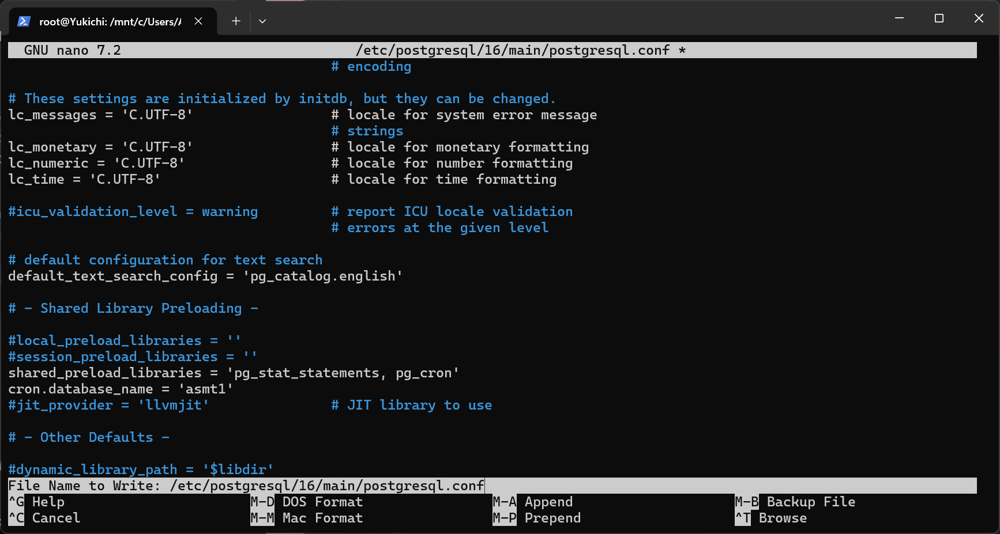

# Assignment 1

```sql
CREATE DATABASE asmt1;
```
### Tables

```sql
CREATE TYPE transaction_status AS ENUM ('PENDING', 'APPROVED', 'DECLINED', 'FLAGGED');
CREATE TYPE account_status AS ENUM ('ACTIVE', 'FROZEN', 'DORMANT', 'CLOSED');
CREATE TYPE card_status AS ENUM ('ISSUED', 'ACTIVE', 'BLOCKED', 'EXPIRED');
CREATE TYPE fraud_alert_status AS ENUM ('NEW', 'INVESTIGATING', 'RESOLVED', 'FALSE_POSITIVE');
CREATE TYPE card_type AS ENUM ('DEBIT', 'CREDIT', 'PREPAID', 'VIRTUAL');
CREATE TYPE fraud_rule_type AS ENUM ('VELOCITY', 'VOLUME', 'LOCATION', 'WATCHLIST', 'DEVICE', 'GLOBAL_RISK_THRESHOLD');


CREATE TABLE countries (
    country_code VARCHAR(3) PRIMARY KEY,
    country_name VARCHAR(150),
    is_high_fraud_risk BOOLEAN
);

CREATE TABLE currencies (
currency VARCHAR(3) PRIMARY KEY
);

CREATE TABLE merchant_category (
    merchant_category_id INT GENERATED ALWAYS AS IDENTITY PRIMARY KEY,
    merchant_category_name VARCHAR(150)
);

CREATE TABLE fraud_rules(
rule_id BIGINT GENERATED ALWAYS AS IDENTITY PRIMARY KEY,
rule_name VARCHAR(50) UNIQUE,
rule_type fraud_rule_type,
threshold_value INT,
is_active BOOLEAN
);

CREATE TABLE customers (
customer_id BIGINT GENERATED ALWAYS AS IDENTITY PRIMARY KEY ,
first_name VARCHAR(250),
last_name VARCHAR(250),
email VARCHAR(250) UNIQUE ,
birth_date DATE,
country_code VARCHAR(3),
created_at TIMESTAMP,
is_active BOOLEAN,
CONSTRAINT fk_country_code FOREIGN KEY (country_code)
    REFERENCES countries(country_code)
    ON DELETE RESTRICT
    ON UPDATE CASCADE
);

CREATE TABLE accounts (
    account_id BIGINT GENERATED ALWAYS AS IDENTITY PRIMARY KEY,
    customer_id BIGINT,
    account_number VARCHAR(50) UNIQUE,
    currency VARCHAR(3),
    balance DECIMAL(10,2) CHECK (balance >= 0),
    status account_status,
    opened_at TIMESTAMP,
    CONSTRAINT fk_customer_id FOREIGN KEY (customer_id)
    REFERENCES customers(customer_id)
    ON DELETE RESTRICT
    ON UPDATE CASCADE,
    CONSTRAINT fk_currency FOREIGN KEY (currency)
        REFERENCES currencies(currency)
        ON DELETE RESTRICT
        ON UPDATE CASCADE
);

CREATE TABLE cards(
card_id BIGINT GENERATED ALWAYS AS IDENTITY PRIMARY KEY,
account_id BIGINT,
card_number_hash VARCHAR(50) UNIQUE,
card_type card_type,
status card_status,
expiration_date DATE,
CONSTRAINT fk_account_id FOREIGN KEY (account_id)
    REFERENCES accounts (account_id)
    ON DELETE RESTRICT
    ON UPDATE CASCADE
);

CREATE TABLE transactions(
transaction_id BIGINT GENERATED ALWAYS AS IDENTITY PRIMARY KEY ,
account_id BIGINT,
card_id BIGINT,
amount DECIMAL(10,2) CHECK(amount > 0),
currency VARCHAR(3),
merchant_category_id INT,
merchant_country_code VARCHAR(3),
status transaction_status,
risk_score INT,
transaction_at TIMESTAMP,
created_at TIMESTAMP,
CONSTRAINT fk_account_id FOREIGN KEY (account_id)
REFERENCES accounts (account_id)
ON DELETE RESTRICT
ON UPDATE CASCADE,
CONSTRAINT fk_card_id FOREIGN KEY (card_id)
REFERENCES cards (card_id)
ON DELETE RESTRICT
ON UPDATE CASCADE,
CONSTRAINT fk_merchant_country_code FOREIGN KEY (merchant_country_code)
REFERENCES countries(country_code)
ON DELETE RESTRICT
ON UPDATE CASCADE,
CONSTRAINT fk_merchant_category_id FOREIGN KEY (merchant_category_id)
REFERENCES merchant_category(merchant_category_id)
ON DELETE RESTRICT
ON UPDATE CASCADE,
CONSTRAINT fk_currency FOREIGN KEY (currency)
REFERENCES currencies(currency)
ON DELETE RESTRICT
ON UPDATE CASCADE
);

CREATE TABLE transaction_status_history (
history_id BIGINT GENERATED ALWAYS AS IDENTITY PRIMARY KEY,
transaction_id BIGINT,
old_status transaction_status,
new_status transaction_status,
changed_at TIMESTAMP,
changed_by VARCHAR(50),
CONSTRAINT fk_transaction_id FOREIGN KEY (transaction_id)
    REFERENCES transactions (transaction_id)
    ON DELETE RESTRICT
    ON UPDATE CASCADE
);

CREATE TABLE audit_log (
audit_id BIGINT GENERATED ALWAYS AS IDENTITY PRIMARY KEY,
customer_id BIGINT,
table_name VARCHAR(250),
operation VARCHAR(500),
old_value JSONB,
new_value JSONB,
changed_at TIMESTAMP,
CONSTRAINT fk_customer_id FOREIGN KEY (customer_id)
REFERENCES customers (customer_id)
ON DELETE RESTRICT
ON UPDATE CASCADE
);

CREATE TABLE fraud_alerts (
alert_id BIGINT GENERATED ALWAYS AS IDENTITY PRIMARY KEY,
transaction_id BIGINT,
rule_id BIGINT,
reason VARCHAR(250),
risk_score INT,
alert_status fraud_alert_status,
created_at TIMESTAMP,
CONSTRAINT fk_rule_id FOREIGN KEY (rule_id)
REFERENCES fraud_rules (rule_id)
ON DELETE RESTRICT
ON UPDATE CASCADE,
CONSTRAINT fk_transaction_id FOREIGN KEY (transaction_id)
REFERENCES transactions (transaction_id)
ON DELETE RESTRICT
ON UPDATE CASCADE
);
```

### Functions
```sql
CREATE OR REPLACE FUNCTION calculate_customer_daily_volume(p_customer_id customers.customer_id%type, target_date DATE)
RETURNS DECIMAL(15,2)
LANGUAGE plpgsql
AS $$
DECLARE
    volume DECIMAL(15,2);
BEGIN
    WITH customer_accounts AS (
        SELECT accounts.account_id, accounts.customer_id
        FROM accounts
        WHERE accounts.customer_id = p_customer_id
    )

    SELECT
        SUM(transactions.amount) INTO volume
    FROM customer_accounts
    JOIN transactions ON transactions.account_id = customer_accounts.account_id
    WHERE DATE(transactions.transaction_at) = target_date
    GROUP BY customer_accounts.customer_id;

    RETURN volume;
END;
$$;

CREATE OR REPLACE FUNCTION is_high_risk_country(p_country_code countries.country_code%type)
RETURNS BOOLEAN
LANGUAGE plpgsql
AS $$
DECLARE
    is_high_fraud_risk_value BOOLEAN;
BEGIN
    SELECT
        is_high_fraud_risk INTO is_high_fraud_risk_value
    FROM countries
    WHERE country_code = p_country_code;

    RETURN is_high_fraud_risk_value;
END;
$$;

CREATE OR REPLACE FUNCTION calculate_transaction_risk_score(
    p_account_id accounts.account_id%type,
    p_merchant_country_code countries.country_code%type,
    p_amount transactions.amount%type
)
RETURNS transactions.risk_score%type
LANGUAGE plpgsql
AS $$
DECLARE
    risk_score transactions.risk_score%type = 0;
    customer_country_code countries.country_code%type;
    transaction_amount_threshold fraud_rules.threshold_value%type;
    transaction_velocity_threshold fraud_rules.threshold_value%type;
    transactions_count_in_last_24_hours INT;
    transaction_account_status account_status;
BEGIN
    SELECT
        c.country_code,
        a.status
    INTO customer_country_code, transaction_account_status
    FROM accounts a
             JOIN customers c ON a.customer_id = c.customer_id
    WHERE a.account_id = p_account_id;

    -- merchant country
    IF is_high_risk_country(p_merchant_country_code)
    THEN risk_score := risk_score + 15;
    END IF;

    -- is merchant country the same as customers
    IF p_merchant_country_code != customer_country_code
    THEN risk_score := risk_score + 15;
    END IF;

    -- is amount suspicious
    SELECT threshold_value INTO transaction_amount_threshold
    FROM fraud_rules
    WHERE rule_name = 'MAX_SINGLE_TRANSACTION_AMOUNT';

    IF transaction_amount_threshold < p_amount
    THEN risk_score := risk_score + 15;
    END IF;

    -- is velocity suspicious
    SELECT threshold_value INTO transaction_velocity_threshold
    FROM fraud_rules
    WHERE rule_name = 'MAX_DAILY_TRANSACTIONS';

    SELECT
        COUNT(*) INTO transactions_count_in_last_24_hours
    FROM transactions
    WHERE account_id = p_account_id
      AND transaction_at - current_timestamp < INTERVAL '24 hours';

    IF transaction_velocity_threshold < transactions_count_in_last_24_hours
    THEN risk_score := risk_score + 15;
    END IF;

    -- is account dormant
    IF transaction_account_status = 'DORMANT'
    THEN risk_score := risk_score + 15;
    END IF;

    RETURN risk_score;
END;
$$;

CREATE OR REPLACE FUNCTION mask_card_number(card_number VARCHAR(16))
RETURNS VARCHAR(16)
LANGUAGE plpgsql
AS $$
BEGIN
    RETURN CONCAT(SUBSTRING(card_number FROM 1 FOR 4),' **** **** ',SUBSTRING(card_number FROM 13 FOR 4));
END;
$$;

CREATE OR REPLACE FUNCTION get_customer_age(p_customer_id customers.customer_id%type)
RETURNS INT
LANGUAGE plpgsql
AS $$
DECLARE
    age INT;
BEGIN
    SELECT
        EXTRACT(YEAR FROM AGE(CURRENT_DATE, birth_date)) INTO age
    FROM customers
    WHERE customer_id = p_customer_id;

    RETURN age;
END;
$$;
```
### Views

```sql

CREATE OR REPLACE VIEW vw_customer_accounts AS
SELECT
    CONCAT(c.first_name, ' ', c.last_name) AS full_name,
    a.*,
    AGE(CURRENT_TIMESTAMP, a.opened_at) AS account_lifetime
FROM customers c
JOIN accounts a ON c.customer_id = a.customer_id;

CREATE OR REPLACE VIEW vw_recent_transactions AS
SELECT
    c.customer_id,
    CONCAT(c.first_name, ' ', c.last_name) AS customer_name,
    t.transaction_id,
    a.account_id,
    mask_card_number(cs.card_number_hash) AS masked_card,
    t.amount,
    t.status,
    t.transaction_at
FROM transactions t
JOIN accounts a ON t.account_id = a.account_id
JOIN customers c ON a.customer_id = c.customer_id
JOIN cards cs ON t.card_id = cs.card_id
WHERE current_timestamp - t.transaction_at < INTERVAL '24 hours';

CREATE OR REPLACE VIEW vw_flagged_transactions AS
SELECT * FROM vw_recent_transactions WHERE status = 'FLAGGED';

CREATE OR REPLACE VIEW vw_customer_risk_profile AS
SELECT
    c.customer_id,
    CONCAT(c.first_name, ' ', c.last_name) AS full_name,
    c.country_code,
    SUM(t.amount) AS lifetime_spent_amount,
    AVG(t.amount) AS average_transaction_amount,
    AVG(t.risk_score) AS average_risk_score,
    COUNT(*) FILTER (WHERE t.status IN ('FLAGGED', 'DECLINED')) AS total_failed_transactions,
    CASE
        WHEN COUNT(t.transaction_id) FILTER (WHERE t.status IN ('FLAGGED', 'DECLINED')) > 5 OR AVG(t.risk_score) > 75 THEN 'CRITICAL'
        WHEN COUNT(t.transaction_id) FILTER (WHERE t.status IN ('FLAGGED', 'DECLINED')) > 0 OR AVG(t.risk_score) > 50 THEN 'HIGH'
        WHEN AVG(t.risk_score) > 20 THEN 'MEDIUM'
        ELSE 'LOW'
    END AS risk_label
FROM customers c
JOIN accounts a ON c.customer_id = a.customer_id
JOIN transactions t ON a.account_id = t.account_id
GROUP BY c.customer_id, c.first_name, c.last_name, c.country_code;

CREATE OR REPLACE VIEW vw_daily_risk_customers_ranking AS
SELECT
    c.customer_id,
    DATE(transaction_at) AS transaction_date,
    CONCAT(c.first_name, ' ', c.last_name) AS full_name,
    AVG(t.risk_score) AS day_risk,
    ROW_NUMBER() OVER(PARTITION BY DATE(transaction_at) ORDER BY AVG(t.risk_score) DESC) as daily_rank
FROM transactions t
JOIN accounts a ON t.account_id = a.account_id
JOIN customers c ON a.customer_id = c.customer_id
GROUP BY DATE(transaction_at), c.customer_id, c.first_name, c.last_name;

```
### Materialized Views
```sql
CREATE MATERIALIZED VIEW mv_daily_fraud_summary AS
WITH stats AS (
SELECT
    DATE(t.transaction_at) AS transaction_date,
    COUNT(*) AS total_transactions,
    SUM(t.amount) AS transaction_amount,
    AVG(t.risk_score) AS average_risk_score,
    COUNT(*) FILTER (WHERE status IN ('FLAGGED')) AS total_flagged_transactions,
    COUNT(*) FILTER (WHERE status IN ('DECLINED')) AS total_declined_transactions,
    COUNT(f.alert_id) AS total_fraud_alerts
FROM transactions t
LEFT JOIN fraud_alerts f ON t.transaction_id = f.transaction_id
GROUP BY DATE(t.transaction_at)
)
SELECT *,
    (
        SELECT
            STRING_AGG(full_name, ', ' ORDER BY daily_rank)
        FROM vw_daily_risk_customers_ranking
        WHERE vw_daily_risk_customers_ranking.transaction_date = stats.transaction_date
          AND day_risk <= 5
    ) As top_risk_customers
FROM stats;
```
### Stored Procedures
- removed procedures about approving the transactions or the processing transactions because they are useless and the triggers already do the job
```sql
CREATE OR REPLACE PROCEDURE create_fraud_alert(
    p_transaction_id transactions.transaction_id%type,
    p_rule_id fraud_alerts.rule_id%type,
    p_reason fraud_alerts.reason%type,
    p_risk_score transactions.risk_score%type
)
LANGUAGE plpgsql
AS $$
BEGIN
    INSERT INTO fraud_alerts
        (transaction_id, rule_id, reason, risk_score, alert_status, created_at)
    VALUES (p_transaction_id, p_rule_id, p_reason,p_risk_score, 'NEW', current_timestamp);
END;
$$;

CREATE OR REPLACE PROCEDURE freeze_account(
    p_account_id accounts.account_id%type
)
    LANGUAGE plpgsql
AS $$
BEGIN
    UPDATE accounts
    SET status = 'FROZEN'
    WHERE account_id = p_account_id;
    COMMIT;
END;
$$;

CREATE OR REPLACE PROCEDURE refresh_fraud_dashboard()
    LANGUAGE plpgsql
AS $$
BEGIN
    REFRESH MATERIALIZED VIEW mv_daily_fraud_summary;
    COMMIT;
END;
$$;
```

### Triggers
```sql
CREATE OR REPLACE FUNCTION trg_func_preprocess_transaction()
RETURNS TRIGGER
LANGUAGE plpgsql
AS $$
DECLARE
    risk_threshold_value fraud_rules.threshold_value%type;
BEGIN
    NEW.risk_score := calculate_transaction_risk_score(NEW.account_id,NEW.merchant_country_code,NEW.amount);

    SELECT threshold_value INTO risk_threshold_value
    FROM fraud_rules
    WHERE rule_name = 'CRITICAL_RISK_SCORE';

    IF NEW.risk_score < risk_threshold_value THEN
        NEW.status := 'APPROVED';
    ELSE
        NEW.status := 'FLAGGED';
    END IF;

    RETURN NEW;
END;
$$;

CREATE OR REPLACE TRIGGER trg_preprocess_new_transaction_risks
BEFORE INSERT OR UPDATE ON transactions
FOR EACH ROW
EXECUTE FUNCTION trg_func_preprocess_transaction();

CREATE OR REPLACE FUNCTION trg_func_create_alert_if_flagged()
RETURNS TRIGGER
LANGUAGE plpgsql
AS $$
DECLARE
    risk_rule_id BIGINT;
BEGIN
    IF NEW.status = 'FLAGGED' AND (TG_OP = 'INSERT' OR OLD.status != 'FLAGGED') THEN
        SELECT rule_id INTO risk_rule_id
        FROM fraud_rules
        WHERE rule_name = 'CRITICAL_RISK_SCORE';
        CALL create_fraud_alert(NEW.transaction_id, risk_rule_id, 'High risk score', NEW.risk_score);
    END IF;
    RETURN NULL;
END;
$$;

CREATE OR REPLACE TRIGGER trg_after_transaction_alert
AFTER INSERT OR UPDATE ON transactions
FOR EACH ROW
EXECUTE FUNCTION trg_func_create_alert_if_flagged();

CREATE OR REPLACE FUNCTION trg_func_update_account_balance()
RETURNS TRIGGER
LANGUAGE plpgsql
AS $$
BEGIN
    IF NEW.status = 'APPROVED' AND (TG_OP = 'INSERT' OR OLD.status != 'APPROVED') THEN
        UPDATE accounts
        SET balance = balance - NEW.amount
        WHERE account_id = NEW.account_id;
    END if;

    RETURN NULL;
END;
$$;

CREATE OR REPLACE TRIGGER trg_update_balance
AFTER INSERT OR UPDATE OF status ON transactions
FOR EACH ROW
EXECUTE FUNCTION trg_func_update_account_balance();

CREATE OR REPLACE FUNCTION trg_func_create_transaction_status_log()
RETURNS TRIGGER
LANGUAGE plpgsql
AS $$
BEGIN
    INSERT INTO transaction_status_history (transaction_id, old_status, new_status, changed_at, changed_by)
    VALUES (NEW.transaction_id,  CASE WHEN TG_OP = 'INSERT' THEN NULL ELSE OLD.status END, New.status, CURRENT_TIMESTAMP, CURRENT_USER);
    RETURN NULL;
END;
$$;

CREATE OR REPLACE TRIGGER trg_transaction_status_update
AFTER INSERT OR UPDATE OF status ON transactions
FOR EACH ROW
EXECUTE FUNCTION trg_func_create_transaction_status_log();

CREATE OR REPLACE FUNCTION trg_func_create_audit_log()
RETURNS TRIGGER
LANGUAGE plpgsql
AS $$
BEGIN
    INSERT INTO audit_log (customer_id, table_name, operation, old_value, new_value, changed_at)
    VALUES (
            CASE WHEN TG_OP = 'DELETE' THEN OLD.customer_id ELSE NEW.customer_id END,
            tg_table_name,
            TG_OP,
            CASE WHEN TG_OP = 'INSERT' THEN NULL ELSE to_jsonb(OLD) END,
            CASE WHEN TG_OP = 'DELETE' THEN NULL ELSE to_jsonb(NEW) END,
            CURRENT_TIMESTAMP
           );
    RETURN NULL;
END;
$$;

CREATE OR REPLACE TRIGGER trg_audit_logging
AFTER INSERT OR UPDATE OR DELETE ON accounts
FOR EACH ROW
EXECUTE FUNCTION trg_func_create_audit_log();

CREATE OR REPLACE TRIGGER trg_audit_logging
AFTER INSERT OR UPDATE OR DELETE ON customers
FOR EACH ROW
EXECUTE FUNCTION trg_func_create_audit_log();
```

### Sample Data Inserts

```sql
-- 1. Currencies
INSERT INTO currencies (currency) VALUES 
('USD'), ('UAH'), ('EUR');

-- 2. Countries
INSERT INTO countries (country_code, country_name, is_high_fraud_risk) VALUES 
('USA', 'United States', FALSE),
('UKR', 'Ukraine', FALSE),
('NGA', 'Nigeria', TRUE);

-- 3. Merchant Categories
INSERT INTO merchant_category (merchant_category_name) VALUES 
('Groceries'), ('Electronics'), ('Crypto Exchange');

-- 4. Fraud Rules
INSERT INTO fraud_rules (rule_name, rule_type, threshold_value, is_active) VALUES 
('MAX_SINGLE_TRANSACTION_AMOUNT', 'VOLUME', 1000, TRUE),
('MAX_DAILY_TRANSACTIONS', 'VELOCITY', 3, TRUE),
('CRITICAL_RISK_SCORE', 'GLOBAL_RISK_THRESHOLD', 40, TRUE);

-- 5. Customers
INSERT INTO customers (first_name, last_name, email, birth_date, country_code, created_at, is_active) VALUES 
('John', 'Doe', 'john.doe@example.com', '1985-06-15', 'USA', CURRENT_TIMESTAMP, TRUE),
('Jane', 'Smith', 'jane.smith@example.com', '1992-11-20', 'UKR', CURRENT_TIMESTAMP, TRUE);

-- 6. Accounts
INSERT INTO accounts (customer_id, account_number, currency, balance, status, opened_at) VALUES 
(1, 'ACC1001', 'USD', 5000.00, 'ACTIVE', CURRENT_TIMESTAMP),
(2, 'ACC1002', 'UAH', 150000.00, 'ACTIVE', CURRENT_TIMESTAMP);

-- 7. Cards
INSERT INTO cards (account_id, card_number_hash, card_type, status, expiration_date) VALUES 
(1, 'hash_1234567890123456', 'DEBIT', 'ACTIVE', '2028-12-31'),
(2, 'hash_9876543210987654', 'CREDIT', 'ACTIVE', '2027-10-31');

-- 8. Transactions
-- Transaction 1: A normal transaction (Should be APPROVED)
INSERT INTO transactions (account_id, card_id, amount, currency, merchant_category_id, merchant_country_code, status, risk_score, transaction_at, created_at) VALUES 
(1, 1, 50.00, 'USD', 1, 'USA', 'PENDING', 0, CURRENT_TIMESTAMP, CURRENT_TIMESTAMP);

-- Transaction 2: A suspicious transaction (High amount + High risk country -> Should be FLAGGED)
INSERT INTO transactions (account_id, card_id, amount, currency, merchant_category_id, merchant_country_code, status, risk_score, transaction_at, created_at) VALUES 
(2, 2, 2000.00, 'UAH', 3, 'NGA', 'PENDING', 0, CURRENT_TIMESTAMP, CURRENT_TIMESTAMP);
```

### Scheduled Refresh (Bonus Task)

```
sudo apt install postgresql-16-cron
```
-change the configs in the db

```sql

CREATE EXTENSION pg_cron;

SELECT cron.schedule(
'nightly_fraud_dashboard_refresh',
'0 1 * * *',
'REFRESH MATERIALIZED VIEW mv_daily_fraud_summary;'
);
```
- check
```sql
SELECT jobid, jobname, schedule, command, database
FROM cron.job;
```

### Analytical queries to check if its working
```sql
SELECT * FROM transactions ORDER BY transaction_id;
SELECT * FROM accounts ORDER BY account_id;
SELECT * FROM fraud_alerts;
SELECT * FROM transaction_status_history;
SELECT * FROM audit_log;
SELECT * FROM vw_recent_transactions;
SELECT * FROM vw_customer_accounts;
SELECT * FROM vw_customer_risk_profile;
SELECT * FROM vw_flagged_transactions;
SELECT * FROM vw_daily_risk_customers_ranking;
SELECT * FROM mv_daily_fraud_summary;
```

### Explanation

Evaluation (BEFORE INSERT): A trigger calls the calculate_transaction_risk_score function, which adds penalty points to the transaction based on several factors: high-risk merchant countries, merchant/customer country mismatches, unusually high single-transaction amounts, high daily transaction velocity, or dormant account statuses.

Flagging: If the total calculated risk score exceeds the active threshold defined in fraud_rules for CRITICAL_RISK_SCORE, the transaction status is altered mid-flight to FLAGGED. Otherwise, it is APPROVED.

Alerting (AFTER INSERT): A secondary trigger catches any transaction marked as FLAGGED and automatically executes the create_fraud_alert stored procedure, lodging a formal investigation record into the fraud_alerts table.

mv_daily_fraud_summary, is maintained via a scheduled automated refresh.

run the queries in order they are in the file

# AI USAGE
- generated insert into sample statements for sample data
- used ai to suggest what values should be in enums like namings
- generated the bussines logic (not queries LOGIC) for the calculate_transaction_risk_score and views
- format the explanation