### Which queries generate the highest load on the database

```sql
SELECT
    query,
    calls,
    total_exec_time,
    mean_exec_time,
    rows
FROM pg_stat_statements
WHERE dbid = (SELECT oid FROM pg_database WHERE datname = current_database()) AND calls > 10
ORDER BY mean_exec_time DESC
LIMIT 25;
```
- the simple updates are talking very big time on average because of blocking and locking
- these specific scrrenshots are from my old db with little data but rest are from the big db

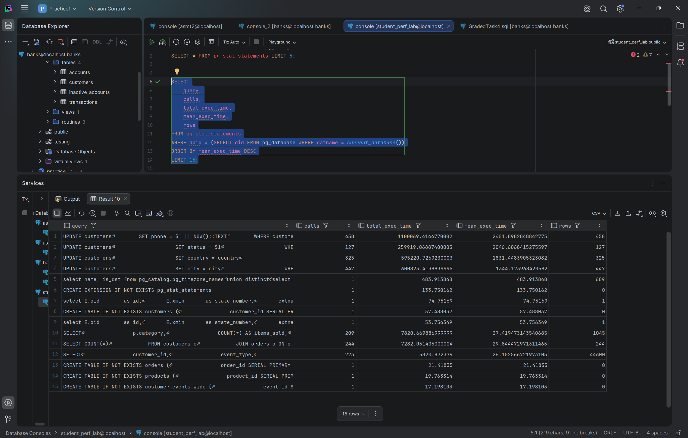

- other inefficient queries noticable
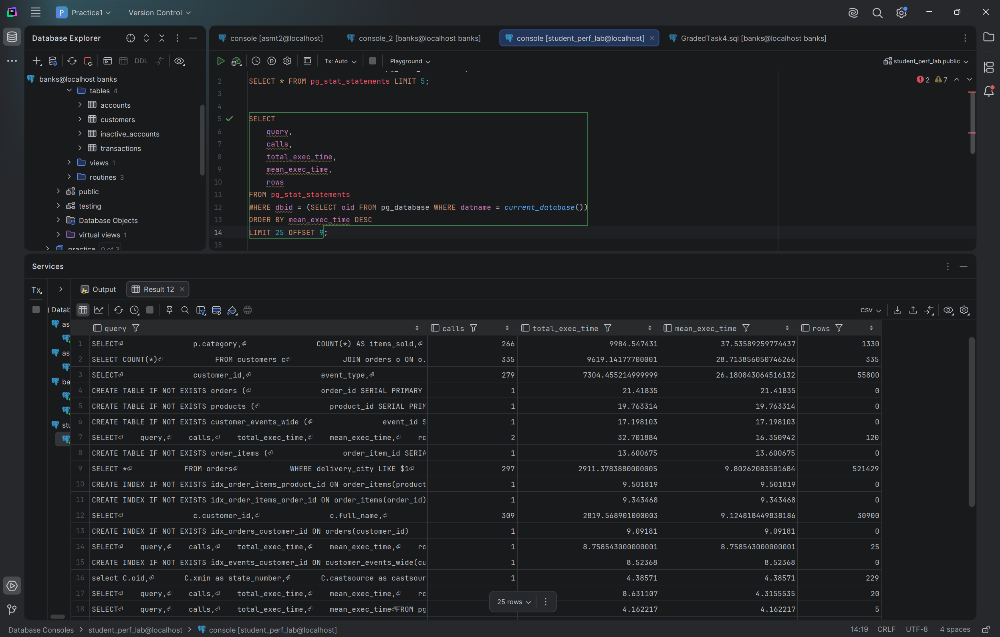
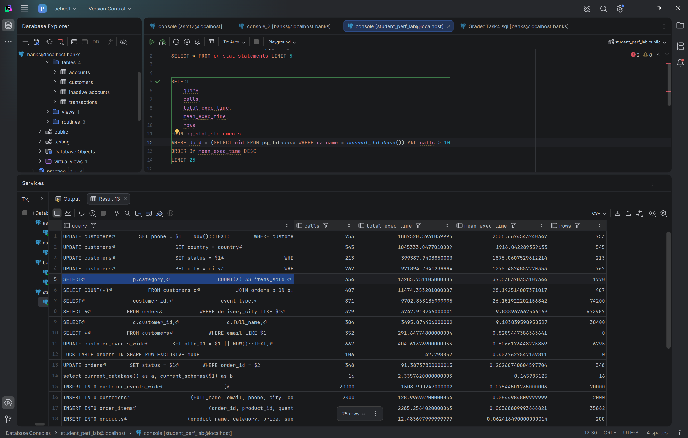

- blocking
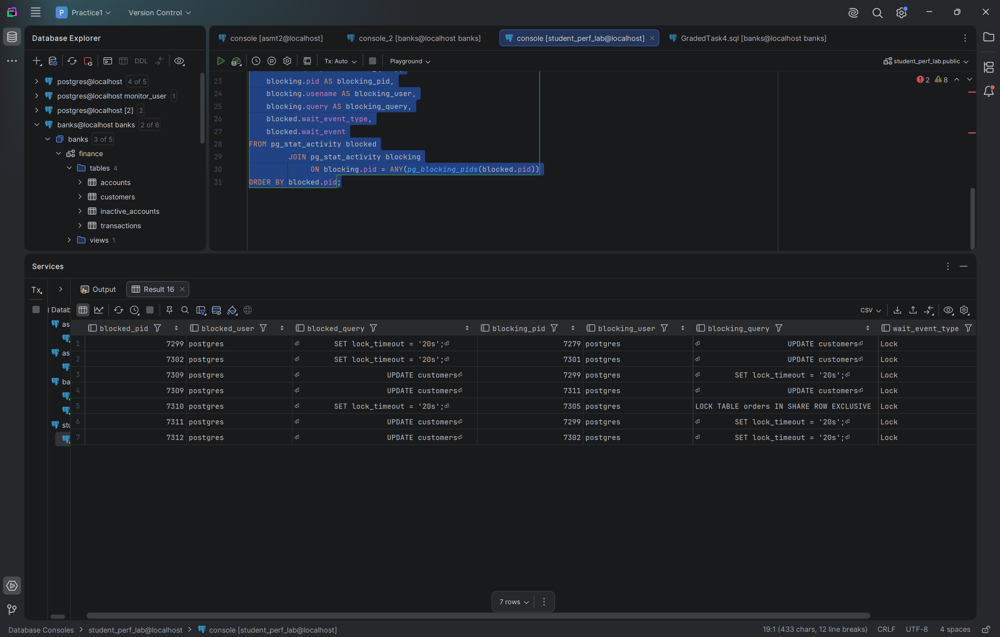


### analysis of slow queries
**1. search_customer_by_email**
```sql
SELECT *
FROM customers
WHERE email LIKE '%gmail%';

```
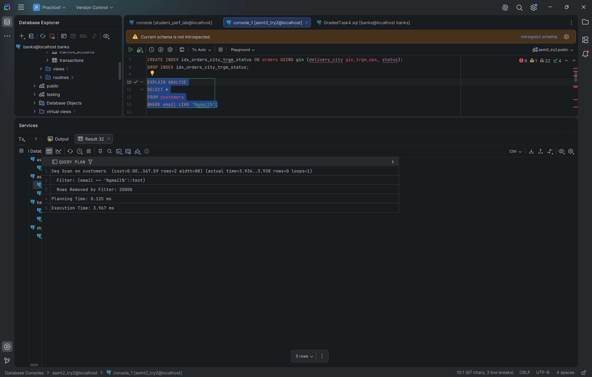

- adding regular index will not work because it sorts by both sides
- the query should be rewritten to not use %smth% and use smth%

- or the query can be kept and the trigram index can be used (splits the string into chunks of three symbols and indexes each string based on all chunks)
```sql
CREATE EXTENSION pg_trgm;
CREATE INDEX idx_email_trgm ON customers USING gin (email gin_trgm_ops);
```

- with index

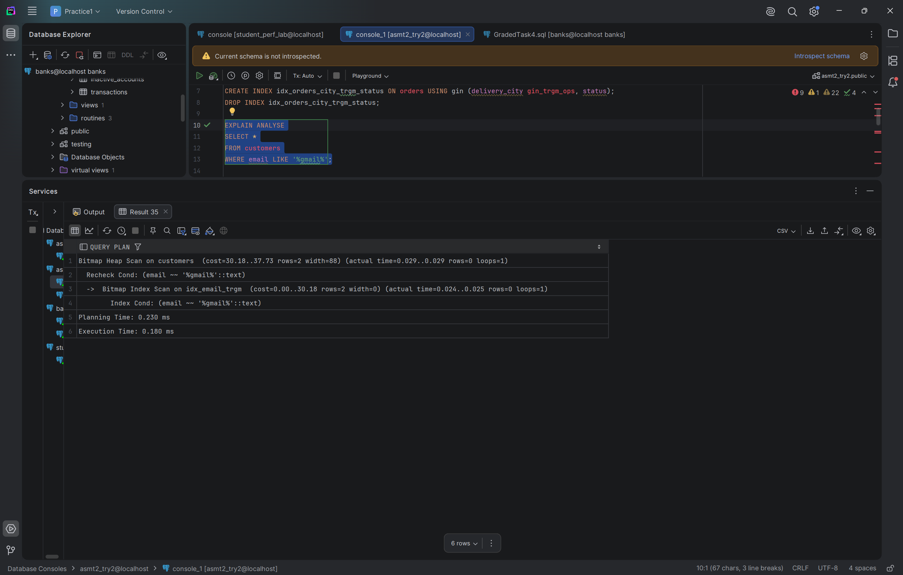

**2. orders_by_city_and_status**

```sql
SELECT *
FROM orders
WHERE delivery_city LIKE '%a%'
  AND status = 'paid';

```

- same situation as with email but the composite index can be applied

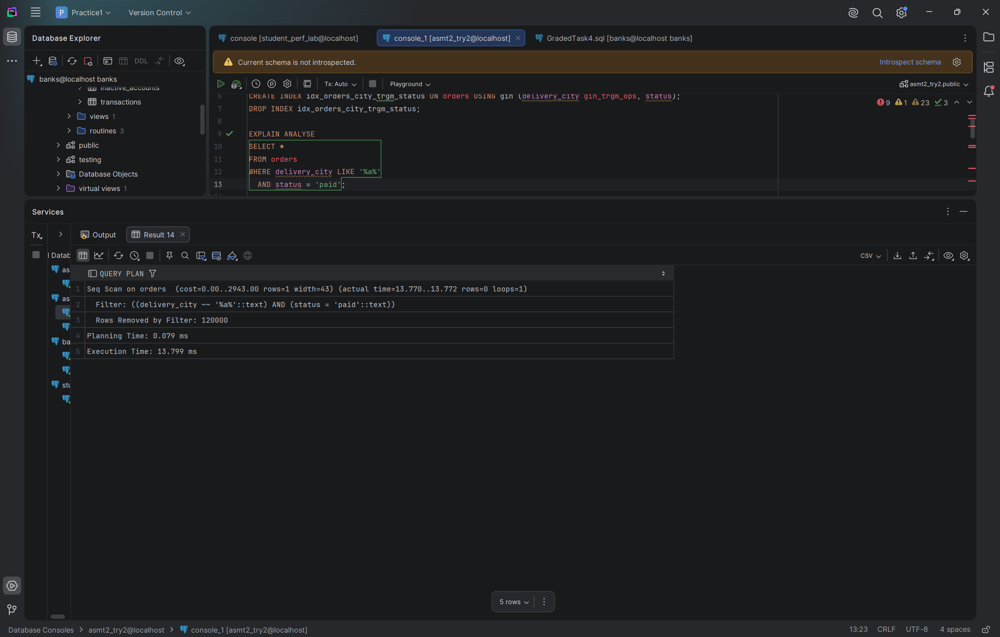
```sql
CREATE EXTENSION IF NOT EXISTS btree_gin;
CREATE INDEX idx_orders_city_trgm_status ON orders USING gin (delivery_city gin_trgm_ops, status);
```
- with index work slighly slower becase of low selectivty and it has to reachek but if the string is bigger it will work better
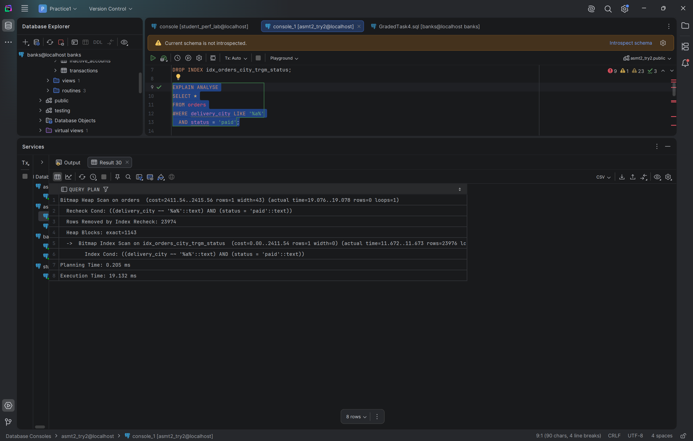


**3. heavy_join**

```sql
SELECT
    c.customer_id,
    c.full_name,
    COUNT(o.order_id) AS orders_count,
    SUM(o.total_amount) AS revenue
FROM customers c
JOIN orders o ON c.customer_id = o.customer_id
WHERE c.status = 'active'
GROUP BY c.customer_id, c.full_name
ORDER BY revenue DESC
LIMIT 100;

```
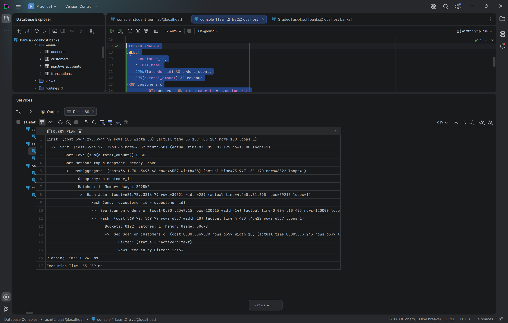
- only join the active sutomers and add index

```sql
WITH active_customers AS (
    SELECT customer_id, full_name
    FROM customers
    WHERE status = 'active'
)
SELECT
    ac.customer_id,
    ac.full_name,
    COUNT(o.order_id) AS orders_count,
    SUM(o.total_amount) AS revenue
FROM active_customers ac
         JOIN orders o ON ac.customer_id = o.customer_id
GROUP BY ac.customer_id, ac.full_name
ORDER BY revenue DESC
LIMIT 100;

CREATE INDEX idx_customers_customer_id_full_name_status ON customers (customer_id, full_name) WHERE status = 'active';
```
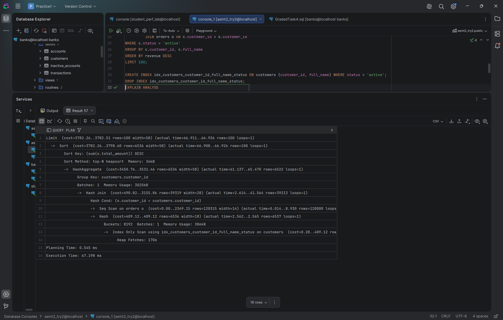


**4. events_aggregation**

```sql
SELECT
    customer_id,
    event_type,
    COUNT(*) AS events_count,
    MAX(event_time) AS last_event_time
FROM customer_events_wide
WHERE event_time >= NOW() - INTERVAL '180 days'
GROUP BY customer_id, event_type
ORDER BY events_count DESC
LIMIT 200;

```
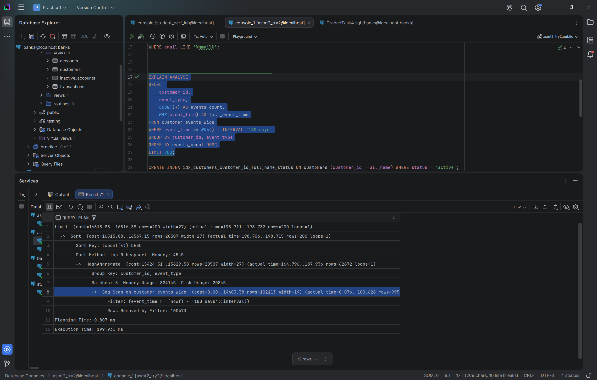
- remove the seq scan with covering index

```sql
CREATE INDEX idx_customer_events_wide_event_time_covering
    ON customer_events_wide (event_time)
    INCLUDE (customer_id, event_type);
```
- but unless you run it like this even if it is faster planner just dosen't use it
```
SET enable_seqscan = OFF;
SET enable_seqscan = ON;
```
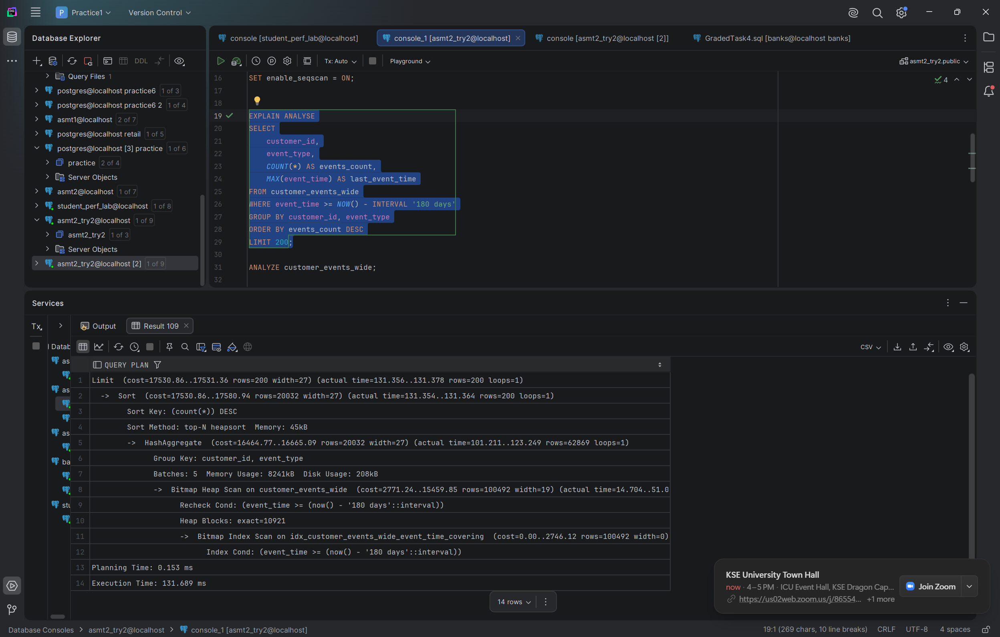


**5. items_products_join**

```sql
SELECT
    p.category,
    COUNT(*) AS items_sold,
    SUM(oi.quantity * oi.unit_price) AS revenue
FROM order_items oi
JOIN products p ON oi.product_id = p.product_id
GROUP BY p.category
ORDER BY revenue DESC;

```

- this query is fine even though it uses seq scnas it is not the bottleneck and it doesn't seem to use GroupAggregate and other indexes I tried to provide because the tables are too small that seq scan is good enough

**6. cartesian_pressure**

```sql
SELECT COUNT(*)
FROM customers c
JOIN orders o ON o.customer_id = c.customer_id
JOIN customer_events_wide e ON e.customer_id = c.customer_id
WHERE c.status IN ('active', 'inactive')
  AND e.event_time >= NOW() - INTERVAL '90 days';

```
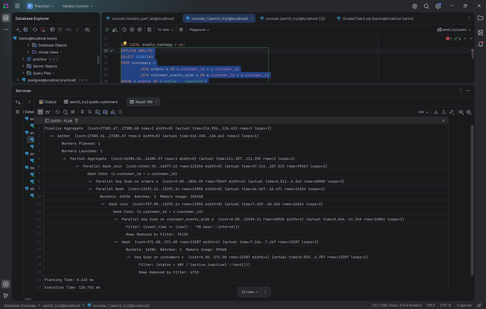

- fix one seq scan and rewrite

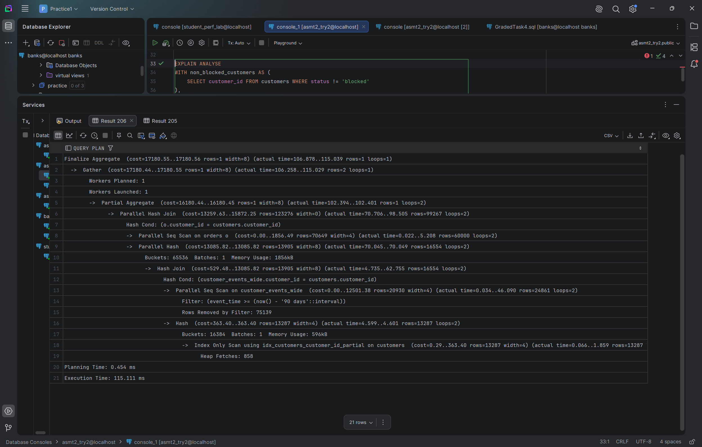

```sql
EXPLAIN ANALYSE
WITH non_blocked_customers AS (
    SELECT customer_id FROM customers WHERE status != 'blocked'
),
latetes_events AS (
    SELECT customer_id FROM customer_events_wide WHERE event_time >= NOW() - INTERVAL '90 days'
)
SELECT COUNT(*)
FROM non_blocked_customers c
         JOIN orders o ON o.customer_id = c.customer_id
         JOIN latetes_events e ON e.customer_id = c.customer_id;

CREATE INDEX idx_customers_customer_id_partial ON customers (customer_id) WHERE status != 'blocked';
```


### Normalizing table and adding partitions

- migrate current dates into partitions and normalised form

```sql
CREATE TABLE IF NOT EXISTS customer_events_partitioned (
    event_id BIGSERIAL NOT NULL, 
    customer_id INT,
    event_type TEXT,
    event_time TIMESTAMP NOT NULL,
    source TEXT,
    campaign TEXT,
    device TEXT,
    browser TEXT,
    os TEXT,
    ip_address TEXT,
    page_url TEXT,
    referrer TEXT,
    utm_source TEXT,
    utm_medium TEXT,
    utm_campaign TEXT,
    PRIMARY KEY (event_id, event_time)
) PARTITION BY RANGE (event_time);
```

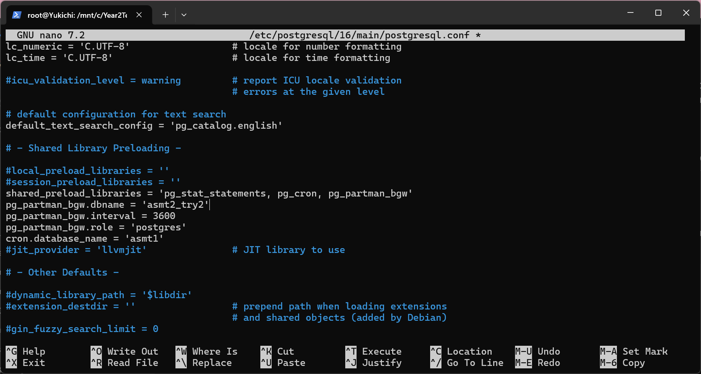

- get initial partition
```sql
SELECT MIN(event_time) FROM customer_events_wide;
```

```sql
SELECT create_parent(
    p_parent_table => 'public.customer_events_partitioned',
    p_control => 'event_time',     
    p_interval => '1 month',
    p_start_partition => '2025-06-12',  
    p_premake => 3          
);
```

```sql
UPDATE part_config 
SET retention = NULL 
WHERE parent_table = 'public.customer_events_partitioned';
```

```sql
SELECT cron.schedule_in_database(
    'partman_maintenance_asmt2', 
    '@hourly', 
    'CALL partman.run_maintenance();', 
    'asmt2_try2'
);
```

- migrate data

```sql
INSERT INTO customer_events_partitioned (
    event_id, customer_id, event_type, event_time, source, campaign, 
    device, browser, os, ip_address, page_url, referrer, 
    utm_source, utm_medium, utm_campaign
)
SELECT 
    event_id, customer_id, event_type, event_time, source, campaign, 
    device, browser, os, ip_address, page_url, referrer, 
    utm_source, utm_medium, utm_campaign
FROM customer_events_wide;
```

```sql
CREATE TABLE IF NOT EXISTS event_attributes (
    event_id BIGINT,
    event_time TIMESTAMP,
    attributes JSONB,
    PRIMARY KEY (event_id, event_time),
    FOREIGN KEY (event_id, event_time) REFERENCES customer_events_partitioned(event_id, event_time)
);
```

```sql
INSERT INTO event_attributes (event_id, event_time, attributes)
SELECT 
    event_id,
    event_time,
    jsonb_strip_nulls(
        jsonb_build_object(
            'attr_01', attr_01,
            'attr_02', attr_02,
            'attr_03', attr_03,
            'attr_04', attr_04,
            'attr_05', attr_05,
            'attr_06', attr_06,
            'attr_07', attr_07,
            'attr_08', attr_08,
            'attr_09', attr_09,
            'attr_10', attr_10
        )
    )
FROM customer_events_wide
WHERE COALESCE(attr_01, attr_02, attr_03, attr_04, attr_05, attr_06, attr_07, attr_08, attr_09,attr_10) IS NOT NULL;
```

- because customer_events_wide is very odd and it has a very big amount of attributes

```sql
CREATE TABLE IF NOT EXISTS customer_events_wide (
    event_id SERIAL PRIMARY KEY,
    customer_id INT,
    event_type TEXT,
    event_time TIMESTAMP,
    source TEXT,
    campaign TEXT,
    device TEXT,
    browser TEXT,
    os TEXT,
    ip_address TEXT,
    page_url TEXT,
    referrer TEXT,
    utm_source TEXT,
    utm_medium TEXT,
    utm_campaign TEXT,
    attr_01 TEXT,
    attr_02 TEXT,
    attr_03 TEXT,
    attr_04 TEXT,
    attr_05 TEXT,
    attr_06 TEXT,
    attr_07 TEXT,
    attr_08 TEXT,
    attr_09 TEXT,
    attr_10 TEXT
);
```

- chenking that queries run faster with partitions

```sql
EXPLAIN ANALYSE
SELECT
    customer_id,
    event_type,
    COUNT(*) AS events_count,
    MAX(event_time) AS last_event_time
FROM customer_events_partitioned
WHERE event_time >= NOW() - INTERVAL '180 days'
GROUP BY customer_id, event_type
ORDER BY events_count DESC
LIMIT 200;
```

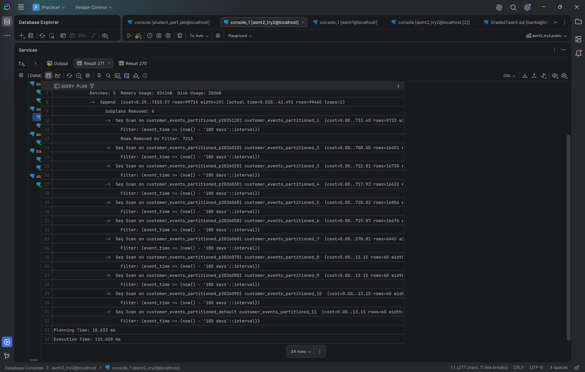


```sql
EXPLAIN ANALYSE
WITH non_blocked_customers AS (
    SELECT customer_id FROM customers WHERE status != 'blocked'
),
     latetes_events AS (
         SELECT customer_id FROM customer_events_partitioned WHERE event_time >= NOW() - INTERVAL '90 days'
     )
SELECT COUNT(*)
FROM non_blocked_customers c
         JOIN orders o ON o.customer_id = c.customer_id
         JOIN latetes_events e ON e.customer_id = c.customer_id;
```


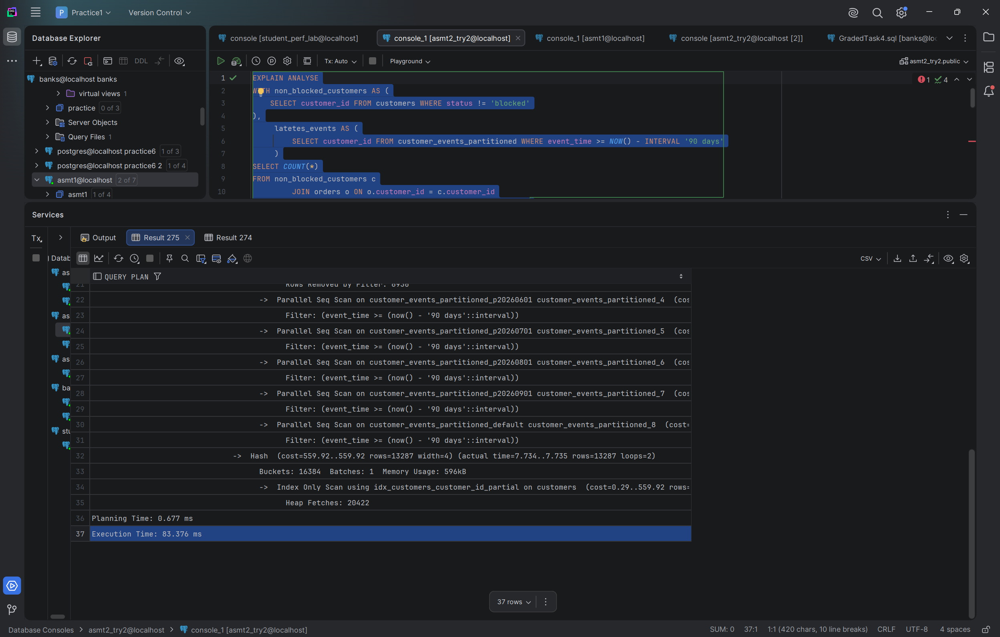

### Removing blocking and refactoring workers
- this updator is now not locking anybodies rows

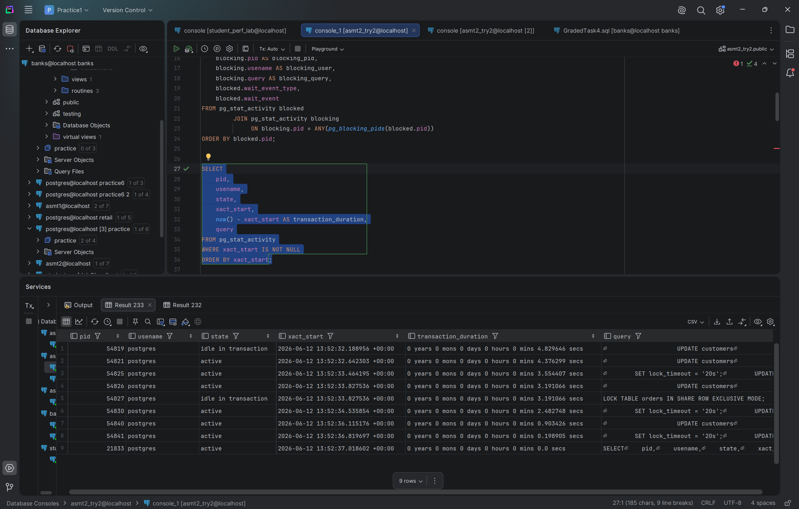
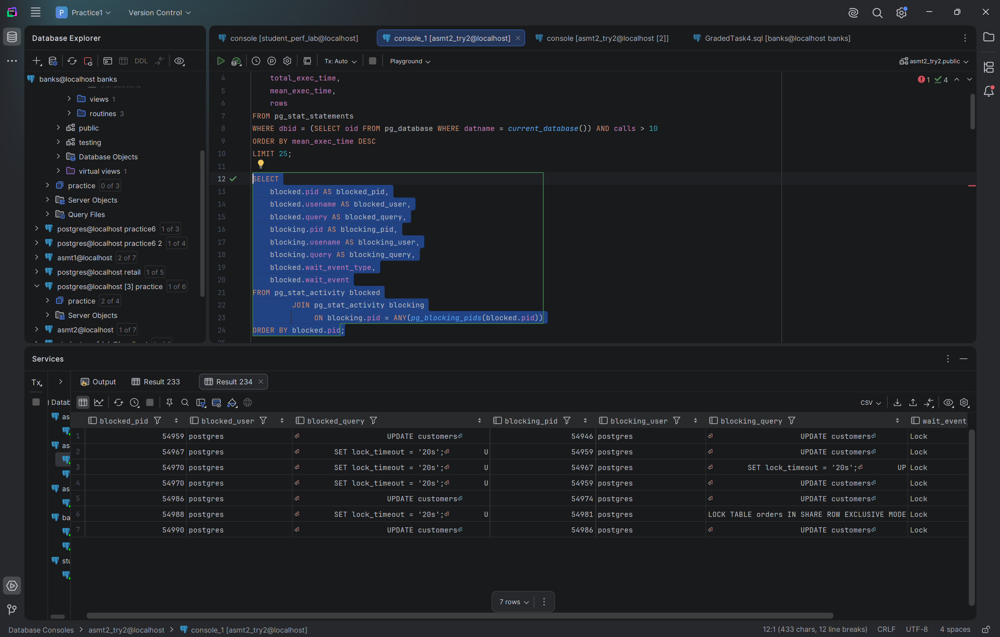
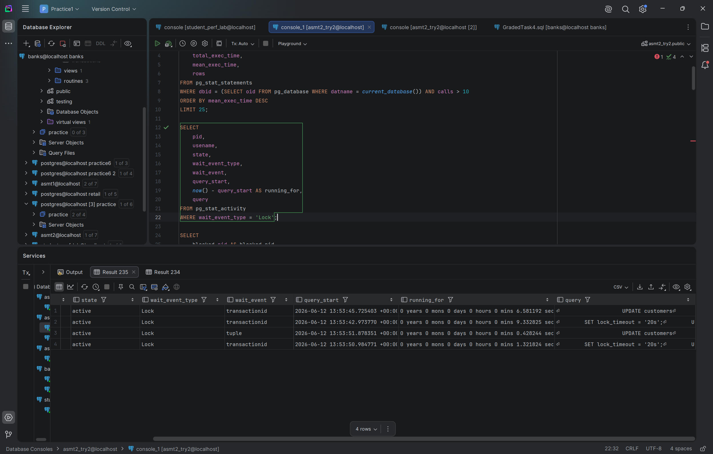

- bunch of blocking one line simple updates

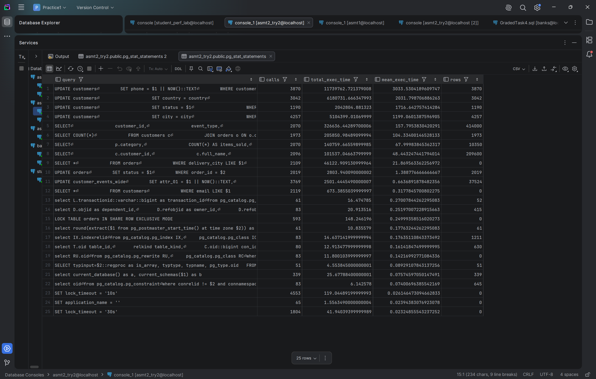

```sql
        UPDATE customer_events_wide
        SET attr_01 = 'updated_' || NOW()::TEXT,
            attr_02 = 'changed',
            attr_03 = 'changed',
            attr_04 = 'changed'
        WHERE customer_id = {customer_id};
```

```sql
UPDATE event_attributes ea
        SET attributes = COALESCE(ea.attributes, '{{}}'::jsonb) || jsonb_build_object(
            'attr_01', 'updated_' || NOW()::TEXT,
            'attr_02', 'changed',
            'attr_03', 'changed',
            'attr_04', 'changed'
        )
        FROM customer_events_partitioned cep
        WHERE ea.event_id = cep.event_id
          AND ea.event_time = cep.event_time
          AND cep.customer_id = {customer_id};
```

```python

def deadlock_worker(name: str, first_customer_id: int, second_customer_id: int) -> None:
    """Creates intentional deadlocks by locking two rows in opposite order."""
    id_1, id_2 = sorted([first_customer_id, second_customer_id])
        
    while True:
        conn = get_conn()
        conn.autocommit = False

        with conn.cursor() as cur:

            cur.execute("""
                UPDATE customers SET city = city WHERE customer_id = %s;
            """, (id_1,))
            time.sleep(1) 

            cur.execute("""
                UPDATE customers SET country = country WHERE customer_id = %s;
            """, (id_2,))

            conn.commit()

```

```python
def row_lock_holder_worker() -> None:
    """Holds row locks on hot customer rows so other sessions wait."""
    while True:
        conn = get_conn()
        conn.autocommit = False

        try:
            with conn.cursor() as cur:
                hot_id = random.choice(HOT_CUSTOMER_IDS)
                cur.execute("SET lock_timeout = '30s';")
                cur.execute("""
                    UPDATE customers
                    SET status = 'active'
                    WHERE customer_id = %s;
                """, (hot_id,))

                conn.commit()

        except Exception as exc:
            print(f"row_lock_holder failed: {type(exc).__name__}: {exc}")
            conn.rollback()

        finally:
            conn.close()

        time.sleep(random.uniform(0.5, 2))

```


```python
def table_lock_worker() -> None:
    """Holds a table-level lock that blocks concurrent writes to orders."""
    while True:
        conn = get_conn()
        conn.autocommit = False

        try:
            with conn.cursor() as cur:
                cur.execute("SET lock_timeout = '30s';")
                conn.commit()
                time.sleep(random.uniform(8, 12))

        except Exception as exc:
            print(f"table_lock_worker failed: {type(exc).__name__}: {exc}")
            conn.rollback()

        finally:
            conn.close()

        time.sleep(random.uniform(3, 6))

```

- now all of these queries are empty because nobody is blocking nobody

```sql
SELECT
    blocked.pid AS blocked_pid,
    blocked.usename AS blocked_user,
    blocked.query AS blocked_query,
    blocking.pid AS blocking_pid,
    blocking.usename AS blocking_user,
    blocking.query AS blocking_query,
    blocked.wait_event_type,
    blocked.wait_event
FROM pg_stat_activity blocked
         JOIN pg_stat_activity blocking
              ON blocking.pid = ANY(pg_blocking_pids(blocked.pid))
ORDER BY blocked.pid;
```

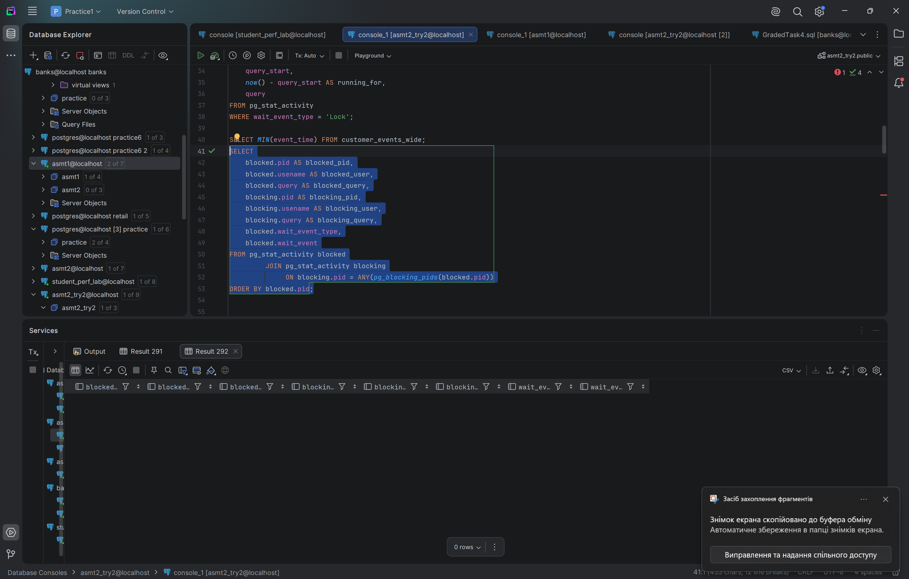
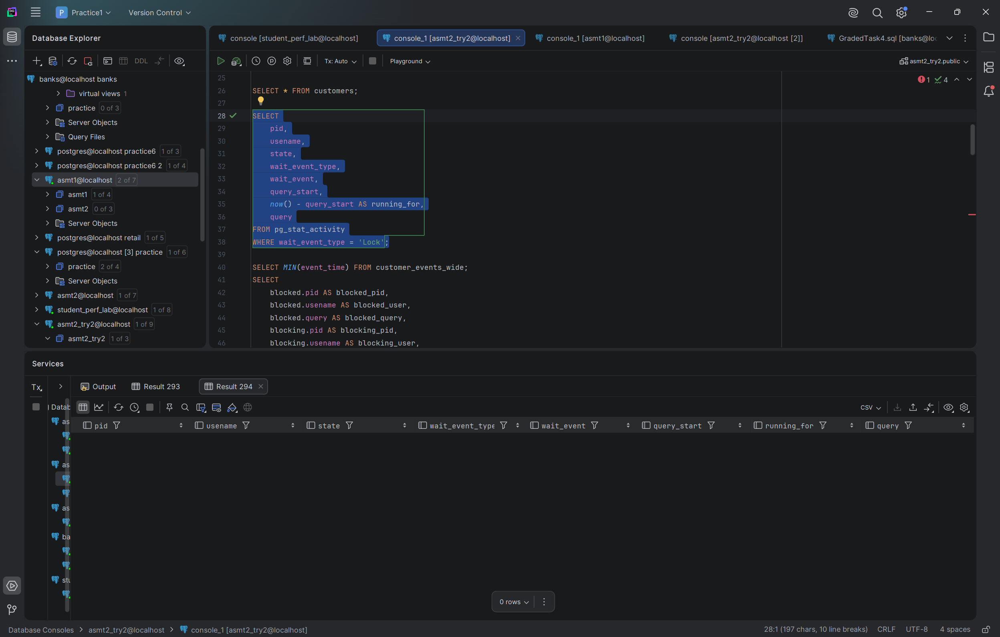

### Vacum analyze everybody espessialy the newly migrated customer_events_partitioned, event_attributes
```sql
VACUUM ANALYZE customers, customer_events_partitioned, orders, order_items, event_attributes, products;
```

### AI usage
- rewriting the initial db population
- getting options how to part cleanly the table or possible other indexes for %situations%
- helping understand the task
- suggesting possible reasons why none of my indexes are used